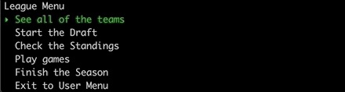

# Fantasy Football Simulator

## General Info

Fantasy Football Simulator is a CLI application that allows multiple users to simulate a 7 week fantasy football season.  The users can draft real NFL teams, then simulate wins and losses and declare a winner!

## Required Technology

- Ruby - 2.6.1
- ActiveRecord - 6.0
- Sinatra - 2.0
- SQLite3 - 1.4
- TTY-Prompt - 0.21.0
- TTY-Font - 0.5.0
- Pry - 0.12.2

## Setup

To simulate a season:

1. Clone the githut repository to your computer.
2. In the root directory of this repository, enter the command: `bundle install`
3. In the root directory of this repository, enter the command: `ruby runner.rb`

## How to use Fantasy Football Simulator

1. Now, to run the application again, just entre the command: `ruby runner.rb` in the root directory.
1. You will see the Main Menu with the following options:
   - Create a username
     - Creates a new username.
   - Log in
     - Log in to an existing username, and access the User Menu.
   - Delete Everything.
     - Deletes all of the existing usernames and their fantasy teams.
   - Exit
     - Exits the application.

    

1. You must create a username before you can log in.
1. After you create a username, you are taken to the User Menu.  From there you can:
   - Join a Fantasy League.
   - Select a Fantasy League you have already joined.
   - Return to the Main Menu.
1. When you have selected a league, you will be taken to the League Menu:
   - See all of the teams in the league.
   - Start a fantasy draft for the league.
   - Sheck the current standings.
   - Play the next week's games.
   - Play all of the games through the end of the season.
   - Exit to the User Menu.

## App Features

 - Join a Fantasy Football League with your friends.
 - Draft your favorite NFL Team:

      

 - Populate the rest of the league with 'computer' players (if you're short on friends)

 - Simulate one week at a time, with outcomes determined by NFL rankings that are shuffled every week

      
 
 - Check the current standings of your Fantasy League

To do:

  - Refactor!
  - Declare a winner of the Fantasy League
  - Let users create their own leagues.

  - Add API to pull in real NFL stats for teams and players
  - Build fantasy draft functions for NFL players

## Contact
  
  Created by [Sam Evans](https://linkedin.com/in/evansst) and [Daniel Madera](https://linkedin.com/in/daniel-madera-925b4987)
